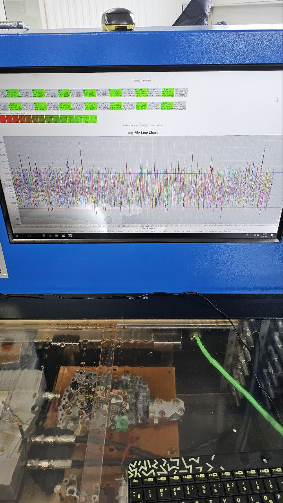

# Кроссплатформенное приложение (Kotlin Multiplatform) с модулем измерений, анализа и управления (пример: мониторинг гидроблока АКПП или других промышленных узлов)
 

<table style= padding:10px">
  <tr>
    <td>   </td>
  </tr>
</table>

